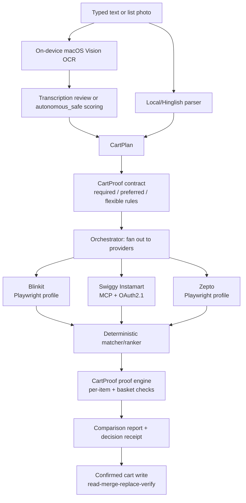

# Photo Shopping

A local-first grocery assistant that turns a typed request or a photo of a handwritten
list into a ranked, reviewable cart — and can price the same basket across Blinkit,
Swiggy Instamart, and Zepto to recommend the cheapest equivalent option. Built as a
deep dive into safe, verifiable LLM/vision-assisted automation: every step that can
touch a real cart is gated, logged, and provable rather than trusted on faith.

## Key features

- **Handwritten list → cart.** On-device macOS Vision OCR reads a photo, an optional
  hosted vision model (Groq/NVIDIA/HF) re-checks only the isolated uncertain lines
  (never the full photo), and a capture-quality preflight catches bad lighting, tilt,
  or blur before OCR ever runs.
- **English/Hindi/Hinglish parsing** for quantities, units, brands, budgets, and price
  preferences, with a local rule-based fallback when no hosted model is configured.
- **Two recognition modes**: an editable transcription-review checkpoint (default), or
  `autonomous_safe` mode, which scores Local Vision, an independent hosted reading, and
  live catalogue matches together and only auto-accepts strong, agreeing readings.
- **CartProof shopping contracts** — the request is turned into an explicit,
  user-confirmed contract (required / preferred / flexible rules per item, brand and
  substitution policy, quantity tolerance, budget caps). A deterministic proof engine
  checks every candidate product and cart against that contract, so a cheaper cart can
  never win by silently violating a required rule.
- **Cross-platform price comparison** across Blinkit, Instamart, and Zepto that
  normalizes to the *same delivered quantity* (e.g., two 250 g packs legitimately cover
  a 500 g requirement) before comparing price, so the comparison isn't apples-to-oranges.
- **Product ranking** on relevance, pack fit, price, discount, delivery, ratings,
  sponsorship, and prior-order preference. This scoring is fully deterministic in
  demo mode, safety-locked mode, or a local model backend (the safe defaults); with a
  hosted backend unlocked, matching can instead delegate the pick to that model,
  constrained to in-stock candidates and re-checked against the same relevance gate.
- **Real Swiggy Instamart integration** over its official MCP endpoint with OAuth 2.1 +
  PKCE + dynamic client registration; tokens are stored in the macOS Keychain, never in
  the browser or project files. Blinkit and Zepto are driven through isolated
  persistent Playwright browser profiles.
- **Cart safety by construction**: no checkout/payment route exists anywhere in the app;
  cart writes require a stack of independent flags (`SAFETY_LOCK`, `DRY_RUN`,
  per-provider `*_CART_WRITES`) all set true; mutations are read-merge-replace-verify to
  avoid lost updates; verified (exact-cart) comparison additionally refuses to run
  against a non-empty cart.
- **Local recovery and privacy-safe diagnostics** — drafts and comparison runs survive a
  server restart for 24h in a local SQLite file that never stores photos, addresses,
  OAuth tokens, or confirmation tokens; `/api/diagnostics` exposes aggregate
  latency/health only.
- **Reliability plumbing for provider calls**: short-lived search-result caching,
  request coalescing, retry with backoff/jitter, and circuit breaking per provider.
- **Demo mode** exercises the full UI against a local catalogue and never touches a real
  cart, useful for review without any provider account.

## Architecture



FastAPI serves both the JSON API and the static frontend (`static/`, vanilla
HTML/CSS/JS — no frontend framework or build step). State that must survive a restart
(drafts, comparison proposals, shopping contracts) is persisted to a local SQLite file
with TTL-based expiry; everything else is in-memory per process.

## Tech stack

| Layer | Choice |
|---|---|
| Backend | Python 3.11+, FastAPI, Uvicorn, Pydantic v2 / pydantic-settings |
| Frontend | Static HTML/CSS/vanilla JS served directly by FastAPI |
| OCR | macOS Vision framework, invoked via subprocess (on-device, no upload) |
| Hosted vision/LLM (optional) | Groq (Qwen3.6), NVIDIA NIM (Nemotron), Hugging Face (Qwen2.5-VL) |
| Instamart integration | Official Swiggy MCP endpoint (`mcp` SDK) over OAuth 2.1 + PKCE |
| Blinkit / Zepto integration | Playwright (Chromium), isolated persistent browser profiles |
| Credential storage | macOS Keychain via `keyring` |
| Persistence | SQLite (drafts, comparison state, shopping contracts) |
| Testing | pytest, pytest-cov |
| Lint/type-check | ruff, pyright |
| CI | GitHub Actions — lint/type/test matrix (Python 3.11 & 3.14), a Playwright browser job, and a macOS job for real Vision OCR regressions |

## Setup

Requires Python 3.11+ (macOS is required for on-device OCR and Keychain storage; other
platforms can still run the app with typed-only input and a hosted vision backend).

```bash
python3 -m venv .venv
source .venv/bin/activate
pip install -r requirements.txt
cp .env.example .env
```

For a fast hosted handwriting second opinion, add a Groq API key to `.env`:

```dotenv
MODEL_BACKEND=local
GROQ_API_KEY=gsk_your_key_here
GROQ_MODEL_ID=qwen/qwen3.6-27b
CLOUD_MODEL_BACKEND=groq
RECOGNITION_POLICY=autonomous_safe
```

Hugging Face and NVIDIA are supported fallbacks. Typed requests fall back to the local
rule-based parser when no hosted model is configured; general dish-to-ingredient
expansion needs hosted planning.

To try it without any provider account, set `DEMO_MODE=true` and skip the provider
setup below entirely.

### Configure Swiggy Instamart

```dotenv
GROCERY_PROVIDER=blinkit
INSTAMART_MCP_URL=https://mcp.swiggy.com/im
SWIGGY_OAUTH_BASE_URL=https://mcp.swiggy.com
SWIGGY_REDIRECT_URI=http://localhost:8000/api/providers/instamart/callback

AUTO_ADD_TO_CART=true
BLINKIT_CART_WRITES=false
INSTAMART_CART_WRITES=false
ZEPTO_CART_WRITES=false
CHECKOUT_DISABLED=true
```

Leave `INSTAMART_CART_WRITES=false` for your first authenticated run — search,
ranking, address selection, and cart reads all work without granting cart-mutation
permission. Flip it to `true` and restart once you've verified those responses.
Checkout is unavailable regardless of this setting; there is no checkout route.

### Blinkit / Zepto (Playwright)

Blinkit and Zepto have no supported public consumer API, so they're driven through
separate persistent Chromium profiles:

```bash
playwright install chromium
```

### Run

```bash
source .venv/bin/activate
uvicorn app.main:app --reload
```

Open [http://127.0.0.1:8000](http://127.0.0.1:8000). The app only answers on
`localhost`/`127.0.0.1`/`::1` (DNS-rebinding protection) — it cannot be reached from
another device on the network by design.

### Tests

```bash
.venv/bin/python -m pytest
```

For full local CI parity:

```bash
pip install -r requirements-dev.txt
.venv/bin/ruff check .
.venv/bin/pyright
.venv/bin/python -m pytest --cov=app
RUN_BROWSER_TESTS=1 .venv/bin/python -m pytest -m browser
```

## Verified state

Everything below was run against this codebase directly (not asserted from memory):

- **399 tests** across 42 test modules: `395 passed, 4 skipped` on `pytest`. The skips
  are the Playwright browser tests, which need `RUN_BROWSER_TESTS=1` and an installed
  Chromium.
- **73% line coverage** (`pytest --cov=app`), against a **65%** floor enforced in CI
  (`fail_under = 65` in `pyproject.toml`).
- `ruff check .` — all checks pass.
- `pyright` — 0 errors, 0 warnings.
- CI (`.github/workflows/ci.yml`) gates every push/PR on three jobs: lint + type-check +
  tests on Python 3.11 and 3.14, and a Playwright browser-smoke job.
- A fourth job runs the real macOS Vision OCR regressions against photographed
  handwriting, but **reports without gating** (`continue-on-error`). Apple changes the
  Vision engine between macOS releases — including point releases — and GitHub publishes
  only major-version runner labels, so exact-output assertions cannot be pinned and
  would drift red on each image bump. The same suite passes in full on a macOS 15.6.1
  dev machine. Treat on-device OCR accuracy as verified locally, not by CI.
- A held-out handwriting evaluator measures OCR accuracy against photos outside the
  fixture set — the in-repo fixtures are regression inputs, not accuracy evidence, and
  the tool refuses to run against the tuned fixture directory:

  ```bash
  .venv/bin/python tools/evaluate_handwriting.py path/to/manifest.json \
    --output handwriting-report.json
  ```

## Further documentation

- [`docs/project-scenario-audit-2026-07-27.md`](docs/project-scenario-audit-2026-07-27.md) —
  degraded-photo, parsing, matching, provider, and security scenario results.
- [`docs/comparison-safety.md`](docs/comparison-safety.md) — the estimated vs. verified
  comparison safety boundary in detail.
- [`docs/comparison-live-test-checklist.md`](docs/comparison-live-test-checklist.md) —
  manual checklist for live provider verification.
- [`docs/cartproof-implementation-handoff.md`](docs/cartproof-implementation-handoff.md) —
  implementation handoff notes and known limitations for the CartProof contract system.

## Screenshots

No screenshots are checked into the repo yet. Run the app locally (`DEMO_MODE=true` is
the fastest path — no provider account needed) to see the transcription review,
CartProof contract editor, and comparison cards.
